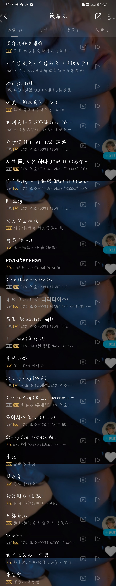
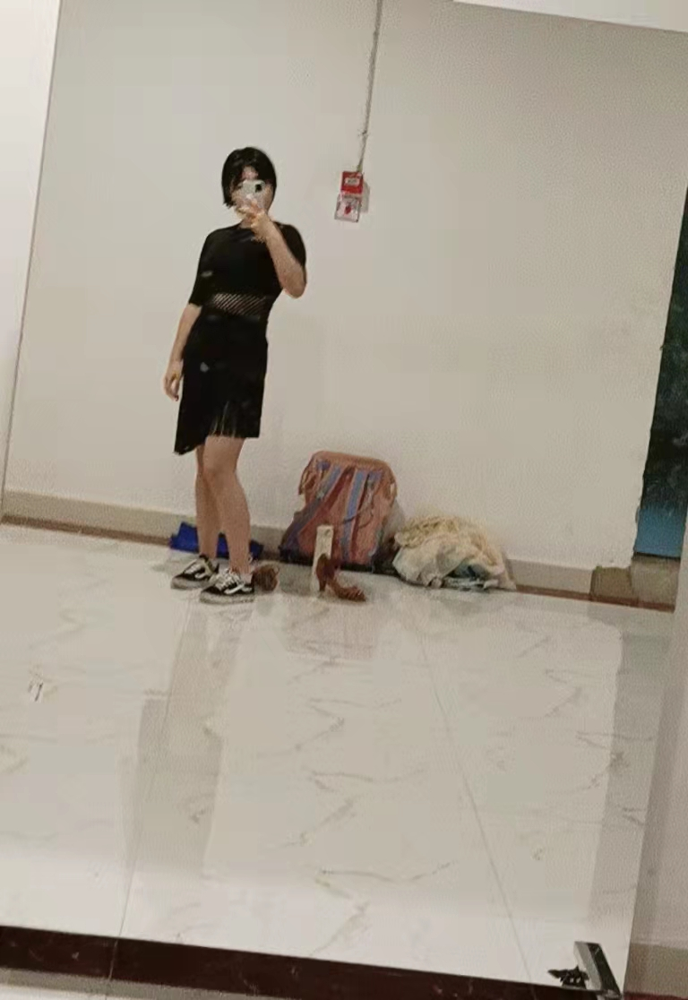

<!DOCTYPE html>
<html lang="zh-cn">
    <head>
        <meta charset="utf-8"/>
        <title>我的第一个网页</title>
    </head>
    <body>
        <h1>个人简介</h1>
      <ul>
        
<li>姓名：许美琳</li>
          <li> 性别：女</li>
          <li>现就读于北京大学药学院
</li>
      </ul>
      <h2>兴趣爱好</h2>
      <ul>
      
<li>1.听歌，瞎唱歌
        </li>
        <li>2.跳舞（目前正在努力学习）
        拉丁舞
          </li>
  </ul>
        3.爱小天（EXO）
        
  

    </body>
</html>
